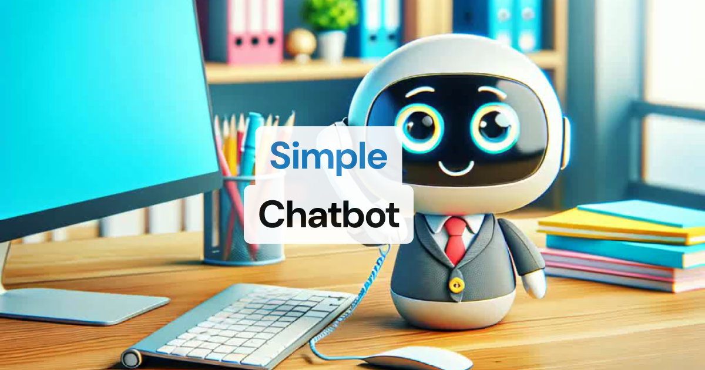

# Simple Chatbot for Pipecat Cloud

This project demonstrates how to build a complete Pipecat AI agent application with both client and server components. It includes a Next.js client for interacting with a Pipecat AI bot server through Daily.co's WebRTC transport.



## Project Overview

- **Server**: Python-based Pipecat bot with video/audio processing capabilities
- **Client**: Next.js TypeScript web application using the Pipecat React & JS SDKs
- **Infrastructure**: Deployable to Pipecat Cloud (server) and Vercel (client)

> See the [simple-chatbot example](https://github.com/pipecat-ai/pipecat/tree/main/examples/simple-chatbot) with different client and server implementations.

## Quick Start (Local run)

You'll need two terminal windows open to run locally.

### Terminal 1: Server Setup

1. Navigate to the server directory:

   ```bash
   cd server
   ```

2. Make sure you have uv installed:

   ```bash
   curl -LsSf https://astral.sh/uv/install.sh | sh
   ```

   > **Need help?** Refer to the [uv install documentation](https://docs.astral.sh/uv/getting-started/installation/).

3. Create a venv and install example dependencies:

   ```bash
   uv sync
   ```

4. Create a `.env` file with your API keys:

   ```bash
   cp env.example .env
   # Edit .env with your API keys
   ```

5. Run the bot:

   ```bash
   python bot.py -t daily
   ```

   > You can join this client via Daily's Prebuilt UI at http://localhost:7860 or follow step 2 to join from the simple-chatbot client.

### Terminal 2: Client Setup

1. In a separate terminal, navigate to the client directory:

   ```bash
   cd client-react
   ```

2. Install dependencies:

   ```bash
   npm install
   ```

Create `.env.local` file and add your `PIPECAT_CLOUD_API_KEY` and `AGENT_NAME`:

    ```bash
    cp env.local.example .env.local
    ```

    > Create a Pipecat Cloud API public key using the dashboard. This key is still a secret, so protect it. It's meant to launch your Pipecat apps.

4. Run the client app:

   ```bash
   npm run dev
   ```

5. Open [http://localhost:3000](http://localhost:3000) to interact with your agent through the Next.js client.

## Deployment

> See the [Pipecat Quickstart](https://docs.pipecat.ai/getting-started/quickstart) for a complete walkthrough.

### Deploy Server to Pipecat Cloud

1. Install the Pipecat CLI:

   ```bash
   uv tool install pipecat-ai-cli
   ```

2. Authenticate:

   ```bash
   pipecat cloud auth login
   ```

3. From the `server` directory, build and push your Docker image:

   ```bash
   cd server
   pipecat cloud docker build-push
   ```

4. Create a secret set for your API keys:

   ```bash
   pipecat cloud secrets set simple-chatbot-secrets --file .env
   ```

5. Deploy to Pipecat Cloud:

   ```bash
   pipecat cloud deploy
   ```

   > IMPORTANT: Before deploying, you need to update your image name in `pcc-deploy.toml` and set up image pull secrets. Learn how to [add an image pull secret](https://docs.pipecat.ai/deployment/pipecat-cloud/fundamentals/secrets#image-pull-secrets).

### Test using Pipecat Cloud Sandbox

You can test your deployment to ensure everything is working using the Pipecat Cloud Sandbox in your [Pipecat Cloud Dashboard](https://pipecat.daily.co).

### Deploy Client to Vercel

1. Push your Next.js client to GitHub

2. Connect your GitHub repository to Vercel

3. Add your `PIPECAT_CLOUD_API_KEY` and `AGENT_NAME` environment variable in Vercel

4. Deploy with the Vercel dashboard or CLI

## Project Structure

```
simple-chatbot/
├── client-next/            # Next.js client application
│   ├── src/
│   │   ├── app/            # Next.js app routes
│   │   │   └── api/
│   │   │       └── connect/ # API endpoint for Daily.co connection
│   │   ├── components/     # React components
│   │   └── providers/      # React providers including RTVIProvider
│   ├── package.json
│
└── server/                # Pipecat bot server
    ├── assets/            # Robot animation frames
    ├── bot.py             # The Pipecat pipeline implementation
    ├── Dockerfile         # For building the container image
   Docker image
    ├── requirements.txt   # Python dependencies
    ├── pcc-deploy.toml    # Pipecat Cloud deployment config
```
